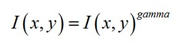
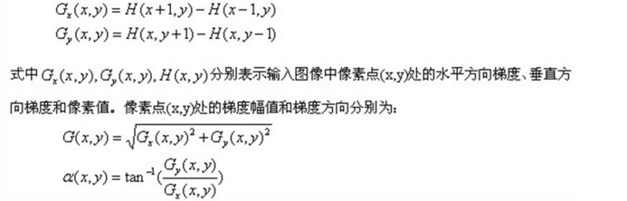
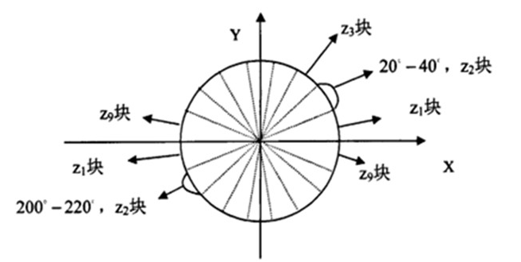
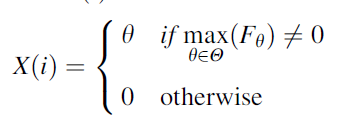
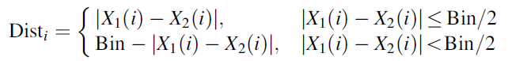
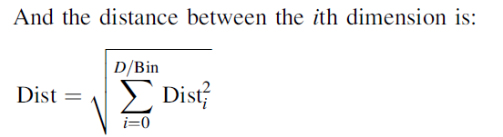

###1 Hog实现过程
$HOG$ 特征提取方法就是将一个 $image$（你要检测的目标或者扫描窗口）：
1. 灰度化（将图像看做一个 $x,y,z$（灰度）的三维图像）；
2. 采用 Gamma 校正法对输入图像进行颜色空间的标准化（归一化）；目的是调节图像的对比度，降低图像局部的阴影和光照变化所造成的影响，同时可以抑制噪音的干扰；
3. ）计算图像每个像素的梯度（包括大小和方向）；主要是为了捕获轮廓信息，同时进一步弱化光照的干扰。
4. ）将图像划分成小 cells（例如 $6*6$ 像素/cell）；
5. ）统计每个cell的梯度直方图（不同梯度的个数），即可形成每个cell的descriptor；
6. ）将每几个cell组成一个block（例如 $3*3$个cell/block），一个block内所有cell的特征descriptor串联起来便得到该block的HOG 特征 descriptor。
7. ）将图像 image 内的所有 block 的 HOG 特征 descriptor 串联起来就可以得到该 image（你要检测的目标）的HOG特征descriptor了。这个就是最终的可供分类使用的特征向量了。

###2 Hog具体工作
####2.1 标准化gamma空间和颜色空间（不过在草图中这个是不必要的）
为了减少光照因素的影响，首先需要将整个图像进行规范化（归一化）。在图像的纹理强度中，局部的表层曝光贡献的比重较大，所以，这种压缩处理能够有效地降低图像局部的阴影和光照变化。因为颜色信息作用不大，通常先转化为灰度图；
     Gamma压缩公式：

比如可以取 $Gamma=1/2$
 
####2.2 计算图像梯度
计算图像横坐标和纵坐标方向的梯度，并据此计算每个像素位置的梯度方向值；求导操作不仅能够捕获轮廓，人影和一些纹理信息，还能进一步弱化光照的影响。
图像中像素点(x,y)的梯度为：

最常用的方法是：首先用 $[-1,0,1]$ 梯度算子对原图像做卷积运算，得到 $x$ 方向（水平方向，以向右为正方向）的梯度分量$gradscalx$，然后用 $[1,0,-1]T$ 梯度算子对原图像做卷积运算，得到 $y$ 方向（竖直方向，以向上为正方向）的梯度分量$gradscaly$。然后再用以上公式计算该像素点的梯度大小和方向。
 
####2.3 为每个细胞单元构建梯度方向直方图
第三步的目的是为局部图像区域提供一个编码，同时能够保持对图像中人体对象的姿势和外观的弱敏感性。
我们将图像分成若干个“单元格cell”，例如每个cell为 $6 \times 6$ 个像素。假设我们采用9个bin的直方图来统计这 $6 \times 6$ 个像素的梯度信息。也就是将 cell 的梯度方向 $360$ 度分成 $9$ 个方向块，如图所示：例如：如果这个像素的梯度方向是$20-40$ 度，直方图第 $2$ 个 $bin$ 的计数就加一，这样，对 cell 内每个像素用梯度方向在直方图中进行加权投影（映射到固定的角度范围），就可以得到这个cell的梯度方向直方图了，就是该cell对应的9维特征向量（因为有 $9$ 个bin）。
        像素梯度方向用到了，那么梯度大小呢？梯度大小就是作为投影的权值的。例如说：这个像素的梯度方向是 $20-40$ 度，然后它的梯度大小是 $2$（假设啊），那么直方图第 $2$ 个 $bin$ 的计数就不是加一了，而是加二（假设啊）。

细胞单元可以是矩形的（rectangular），也可以是星形的（radial）。
 
####2.4 把细胞单元组合成大的块（block），块内归一化梯度直方图
由于局部光照的变化以及前景-背景对比度的变化，使得梯度强度的变化范围非常大。这就需要对梯度强度做归一化。归一化能够进一步地对光照、阴影和边缘进行压缩。

作者采取的办法是：把各个细胞单元组合成大的、空间上连通的区间（blocks）。这样，一个block内所有cell的特征向量串联起来便得到该block的HOG特征。这些区间是互有重叠的，这就意味着：每一个单元格的特征会以不同的结果多次出现在最后的特征向量中。我们将归一化之后的块描述符（向量）就称之为HOG描述符。

 区间有两个主要的几何形状——矩形区间（R-HOG）和环形区间（C-HOG）。R-HOG区间大体上是一些方形的格子，它可以有三个参数来表征：每个区间中细胞单元的数目、每个细胞单元中像素点的数目、每个细胞的直方图通道数目。
       例如：行人检测的最佳参数设置是：3×3细胞/区间、6×6像素/细胞、9个直方图通道。则一块的特征数为：3*3*9；
 
####2.5 收集HOG特征
最后一步就是将检测窗口中所有重叠的块进行HOG特征的收集，并将它们结合成最终的特征向量供分类使用。
     
###3 改进算法
文中作者认为没有存储所有梯度方向的必要，只需要选取最大振幅的梯度就可以作为一个HoG cell的主成分，一个cell的主成分被定义为：
where H is the collection of the 8 orientations, Fh indicates
the amplitude in orientation h. There is no principal component if the cell is empty while XðiÞ equals to 0.
两个不同图片中取出的主成分组成的梯度方向的夹角计算方法如下：

